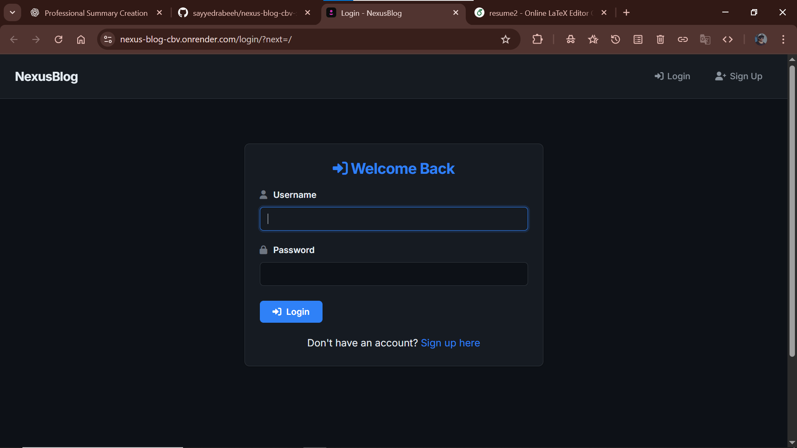
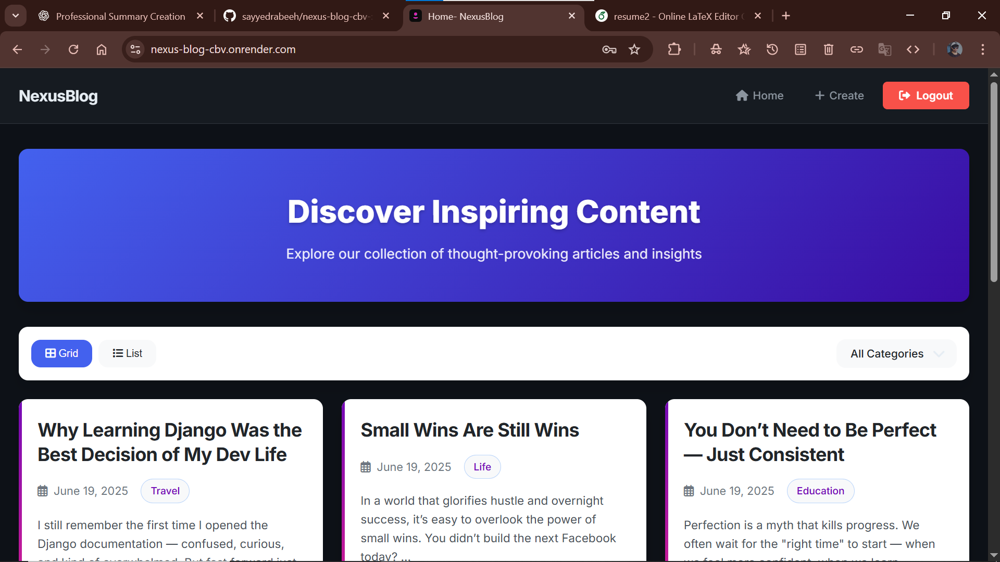
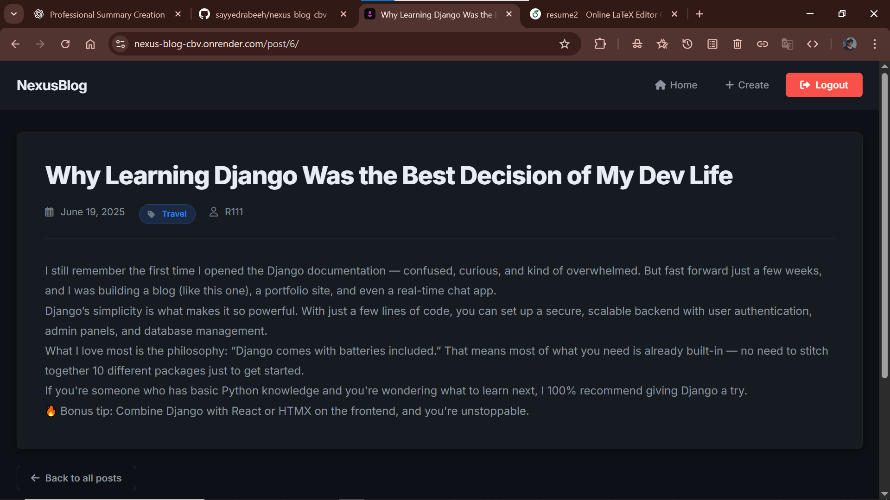
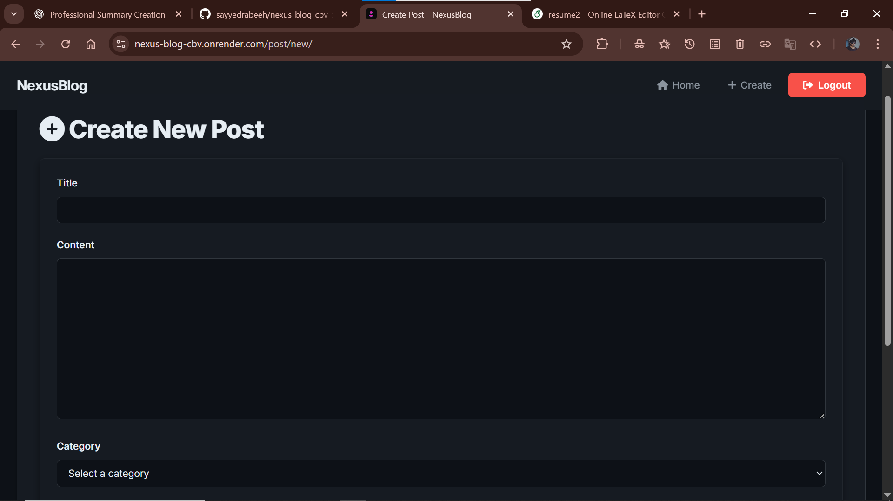

#  Nexus Blog (Django CBV)

Nexus Blog is a **Django-powered blog application** built using **Class-Based Views (CBV)**.  
It supports **user authentication**, **CRUD operations**, **category-based filtering**, **pagination**, and is **deployed live on Render**.

🔗 **Live Demo:** https://nexus-blog-cbv.onrender.com

---

##  Features

- 🔐 User Authentication (Login / Logout / Signup)
- 📝 Create, Read, Update & Delete Blog Posts
- 🗂️ Category-wise Post Filtering
- 📄 Pagination for Blog Posts
- 🔒 Login Required Access using `LoginRequiredMixin`
- ⚡ Built with Django Class-Based Views
- ☁️ Deployed on Render (Production-ready)

---

## 🛠️ Tech Stack

- **Backend:** Django 5 (CBV)
- **Frontend:** HTML, CSS, Bootstrap
- **Database:** SQLite (can be upgraded to PostgreSQL)
- **Authentication:** Django Auth System
- **Deployment:** Render
- **WSGI Server:** Gunicorn

---

## 📸 Screenshots

 

### 🔐 Login Page

### 🏠 Home / Post List Page

### 📖 Post Detail Page

### ✍️ Create / Edit Post Page

---